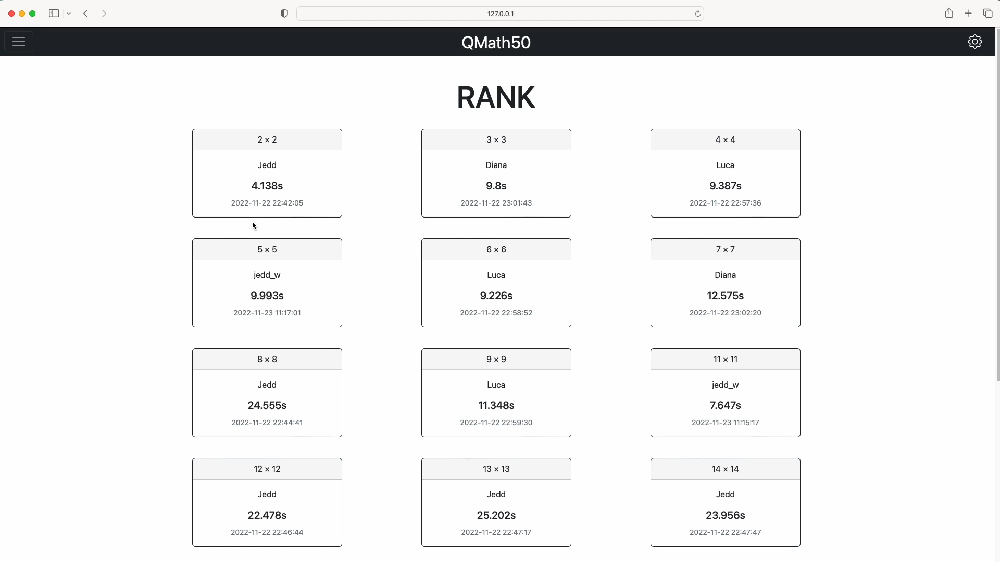
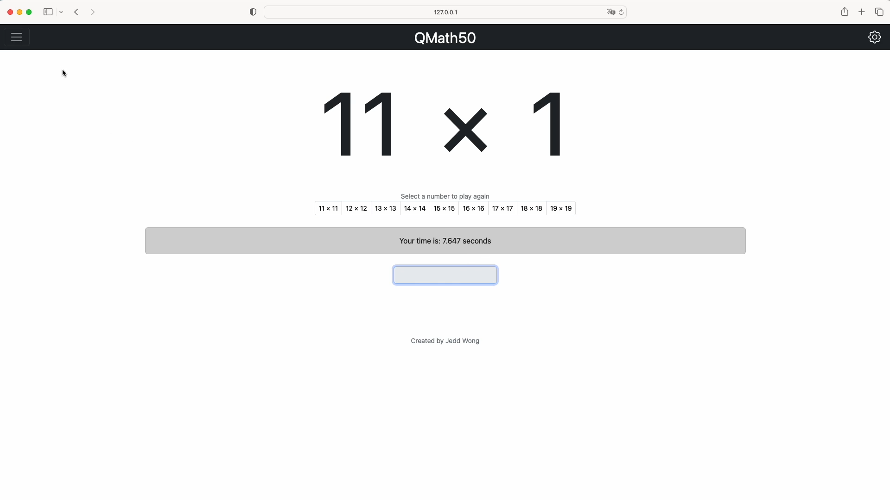

# QMath50

## Motivation
This project was inspired by my son's journey in learning multiplication tables. The fundamental concept behind QMath50 is that basic multiplication (2-9) shouldn't require calculation - it should be muscle memory through practice. This extends to advanced multiplication (11-19) as well, where with enough practice, answers can become instantaneous rather than calculated. This educational need became the perfect opportunity for my CS50 Final Project.

#### Video Demo:

#### Description:
QMath50 is a multiplication practice game that allows users to practice multiplication from 2 to 19 and allows different users to compete on the number of multiplications.

## Technologies
- Python
- Flask
- Javascript
- Ajax
- HTML
- CSS
- Bootstrap 5.2

## Features
### Register
Allow users to create an account to store all game records.
- All fields must be filled in
- Enter a username of your choice (case sensitive)
- Enter a password of your choice (case sensitive)
    - **PLEASE DO NOT USE YOUR ACTUAL PASSWORD!**
- Enter the password again, and if it is correct, you will be able to create an account successfully.
- If the username is already occupied, it will appear "Username is already taken", please select another username
- If there is a "password mismatch", please check your password and re-enter it carefully

#### Login
- All fields must be filled in
- If the username and password are correct, you will be able to log in without any problems.
- If there is an "Invalid username and/or password", please check your username and password and re-enter it carefully.
    - Please note that the username and password are **CASES SENSITIVE**

### Statistics Page
It shows users their best time in each multiplier game.
- If you are logging in for the first time, all card details will be displayed as **None**.
- There are 17 cards in the STATISTICS, multiplying 2-9 (no 10 in the game)
- After you have played a game, your current best time will be shown on the card for that multiplication of the number.
- Card information includes:
    - Your best time
    - Date and time of completion
- Each time you complete a game, it will be updated here in real time

### Basic Game
- The basic game is the multiplication of 2 to 9
- Choose a number of multiplication you would like to practice
- Click on the input field and you will see the cursor flashing
- When ready, you can start entering your answers as fast as possible.
- The system will start timing while you are typing
    - The system will start timing when you press Enter for the first time
- When finished, a pop-up will show you the time required to complete the game.
    - When your time is **SLOWER** than your previous best time, the system will report "Your time is: x.xxx seconds".
    - When your time is **FASTER** than your previous best time, the system will display "New record! x.xxx seconds".
- If the completion time is **FASTER** than before, it will be updated in Statistics immediately.

### Advanced Game
- The basic game is the multiplication of 11 to 19
- **The GAME DOES NOT INCLUDE MULTIPLICATION BY 10**
    - Apparently, it is too easy
- Choose a number of multiplication you would like to practice
- Click on the input field and you will see the cursor flashing
- When ready, you can start entering your answers as fast as possible.
- The system will start timing while you are typing
    - The system will start timing when you press Enter for the first time
- When finished, a pop-up will show you the time required to complete the game.
    - When your time is **SLOWER** than your previous best time, the system will report "Your time is: x.xxx seconds".
    - When your time is **FASTER** than your previous best time, the system will display "New record! x.xxx seconds".
- If the completion time is **FASTER** than before, it will be updated in Statistics immediately.

### Multiplication Table
- Here are two multiplication tables
    - 2 to 9 of multiplication
    - 11 to 19 of multiplication
- The multiplication of 2 to 19 can be memorised by reciting it instead of calculating it every time
- So the user can recite it here and then test your memory in the game

### Rank
Rank will show you the fastest user for each multiplication in the database. Here you can see their username, best time and the date they completed it.
- Each card here has four pieces of information
    - Number of multiplication
    - Username
    - The best time
    - Date and time of completion
- The system compares the best time in the database each time the user completes the game.
- If the user's time is faster than the time in the database, he can get on the RANK,
    - which shows his name, the best time and the date and time of completion on the card multiplied by that number

### Change Password
Provide an option to change the password
Please check your password carefully, if you lose it, you will lose your account entirely, we do not offer account recovery.